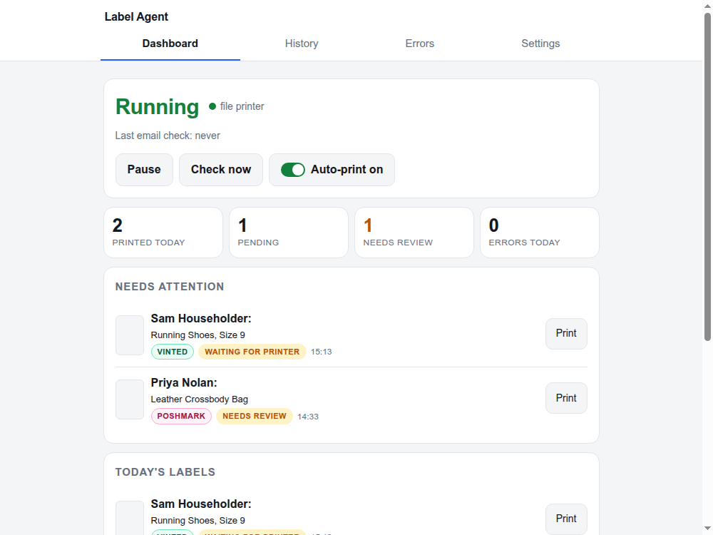
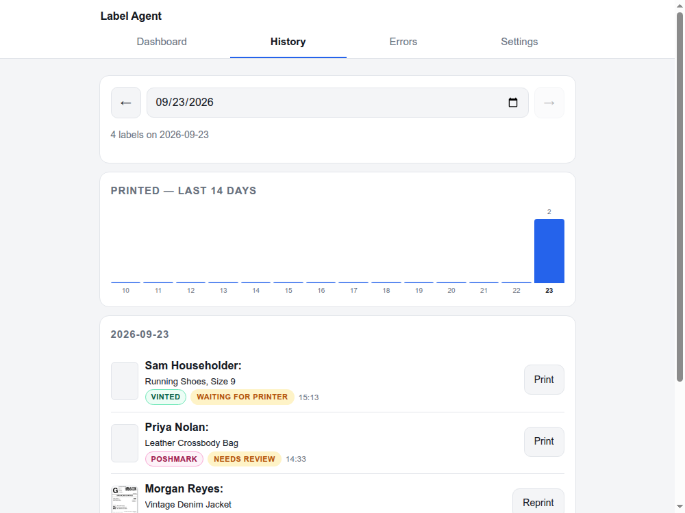
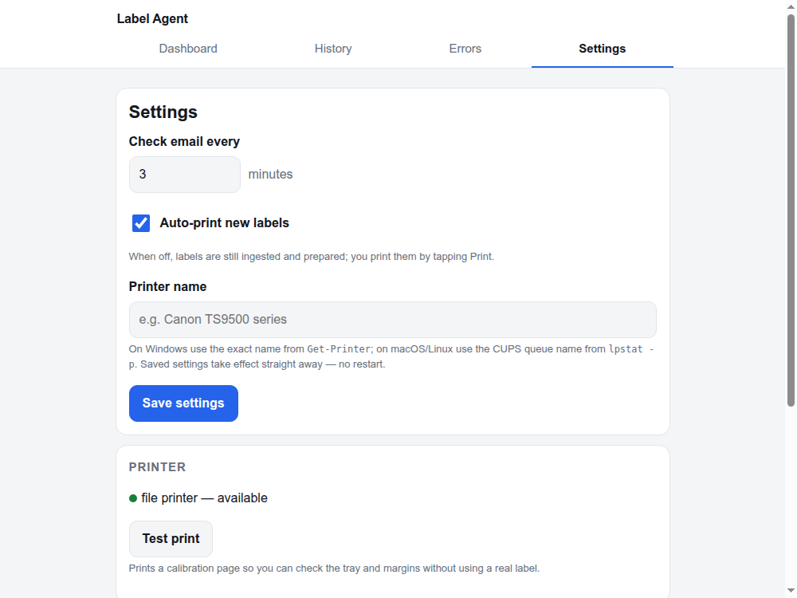

# Label Agent

**Unofficial third-party utility.** Label Agent is not affiliated with,
endorsed by, or officially connected to Poshmark, Vinted, USPS, FedEx, Google,
Anthropic, or Replicate. All product and company names are trademarks of their
respective owners.

Selling on Poshmark or Vinted means every sale drops a prepaid shipping-label
PDF into your Gmail inbox — usually the wrong size and shape for a label
printer, and one more browser tab away from actually being printed. Label
Agent watches your inbox for that email, normalizes whatever PDF it finds into
an exact, print-ready 4×6 label, verifies it's actually printable (barcode
decode, ink-coverage check, and an optional vision-model sanity check), and
sends it straight to your printer — automatically, or on demand from a phone
via a small dashboard on your home network. The dashboard also keeps history:
what printed today, what's pending, and a reprint button for anything.

It works entirely from your own Gmail account: Label Agent never logs into,
automates, or interacts with your Poshmark or Vinted seller account, and it
never calls either platform's API. It only accesses the shipping-label emails
your own inbox already receives, over IMAP, the same way any mail client
would — including filing each one away once it's handled (see "Gmail app
password" below for exactly what that does to your inbox).

Everything runs in one process on one machine and keeps its state in a single
`data/` directory.

Background and design: [SCOPE.md](SCOPE.md) (what and why),
[SPEC.md](SPEC.md) (how).

## Quickstart

```sh
uv venv
uv pip install -e ".[dev]"

cp config.example.toml config.toml     # non-secret settings
cp .env.example .env                   # Gmail app password, Anthropic key

.venv/bin/python -m labelagent db-init
```

On Windows PowerShell the Python path is `.venv\Scripts\python.exe`, and the
copy commands are `Copy-Item config.example.toml config.toml` and
`Copy-Item .env.example .env`.

Try the pipeline on the two example labels without touching email or the
printer:

```sh
.venv/bin/python -m labelagent process \
    tests/fixtures/poshmark-label.pdf tests/fixtures/vinted-label.pdf -o /tmp/labels
# poshmark-label.pdf: passthrough ok -> /tmp/labels/poshmark-label-4x6.pdf
# vinted-label.pdf: raster-crop ok -> /tmp/labels/vinted-label-4x6.pdf
```

Then run the whole thing:

```sh
.venv/bin/python -m labelagent serve
```

`label-agent` is also installed as a console script, so `label-agent serve`
works once the venv is active.

## How it works

One process, five pipeline stages, one SQLite database tying them together:

1. **Ingest** — every few minutes it polls Gmail over IMAP for unprocessed
   messages from `poshmark.com` / `vinted.com` that carry a PDF attachment
   (direct or forwarded copies both count).
2. **Classify** — a cheap Haiku call (when an Anthropic API key is configured)
   pulls out item, order/transaction id, tracking number and ship-by date;
   regexes fill in anything the model omits, and the regex's tracking number
   always wins when the regex finds one. Same tracking number twice → the
   second one is a `duplicate` and is not auto-printed.
3. **Normalize / crop** — the PDF is normalized to exactly 288×432 pt:
   Poshmark labels are already ~4×6 and are scaled; Vinted labels sit on a
   letter-landscape page and get cropped (vector border first, OpenCV
   contours as fallback), rotated and scaled.
4. **Verify** — page size, ink coverage, and a `pyzbar` decode of the tracking
   barcode, plus an optional vision check. A label that fails verification
   becomes `needs_review` and is never printed silently.
5. **Print / dashboard** — good labels are submitted to the host print
   system (SumatraPDF + the Windows spooler on Windows, CUPS on macOS/Linux),
   and every label's status, history, and previews are visible on the
   dashboard regardless of whether it printed cleanly. If the printer is
   unavailable, the label remains visible rather than being silently dropped
   or blindly duplicated.

[SPEC.md](SPEC.md) is the original design document for these stages; some
implementation specifics (e.g. exact verification/printing mechanics) have
evolved since it was written, so treat it as background rather than a current
technical reference — read the source under `labelagent/` for exactly how a
given stage behaves today.

## Configuration

Two files, neither committed:

- **`config.toml`** — non-secret settings (poll interval, printer name and media
  options, auto-print default, web host/port, retention). Every key is
  documented in `config.example.toml`, and every key can be overridden by an
  environment variable.
- **`.env`** — secrets: `LABELAGENT_IMAP_USER`, `LABELAGENT_IMAP_PASSWORD`,
  `ANTHROPIC_API_KEY`, and optionally `REPLICATE_API_TOKEN`. See
  `.env.example`.

**Upgrading from a version where `config.toml` was tracked in git?** Back up
your settings first (`cp config.toml config.toml.bak`) before pulling — it's
now gitignored, so a pull can otherwise overwrite or delete a locally-edited
copy. Restore your settings into it afterward; it stays untracked from then on.

Leaving `printer_name` empty (or `"file"`) selects the built-in fake printer,
which copies each PDF into `data/printed/` instead of printing. Useful for
setting things up before the printer is ready.

A few settings can also be changed from the web app's Settings page (poll
interval, auto-print, printer name); those are stored in the database, win
over `config.toml`, and take effect straight away — the running service picks
up a new printer and re-times its next mailbox check without a restart.

### Gmail app password

The agent authenticates to a single Gmail account (e.g. `seller@example.com`)
where the platform mail lands — either directly, or forwarded in from wherever
the seller's Poshmark/Vinted accounts are actually registered. It uses IMAP
with a Google **app password** — no OAuth app to maintain, and nothing expires
unless the password is revoked.

1. Sign in to that Google account and open
   [myaccount.google.com/security](https://myaccount.google.com/security).
2. Turn on **2-Step Verification** if it isn't already — app passwords are only
   available on accounts that have it.
3. Go to **App passwords** (search "app passwords" in the account settings),
   create one named `label-agent`, and copy the 16-character value.
4. Put it in `.env`:

   ```sh
   LABELAGENT_IMAP_USER=seller@example.com
   LABELAGENT_IMAP_PASSWORD=abcdefghijklmnop
   ```

5. Check it works: `.venv/bin/python -m labelagent check-now`.

The mailbox is opened read-only apart from two things, both applied only to a
message once it's been safely handled: it gets the Gmail label
`label-agent/processed` (how a reinstall or a lost database still can't cause
double prints), and it's archived — Gmail's `Inbox` label is removed, so the
message moves out of Inbox into All Mail. It stays fully intact and
searchable there; nothing is ever marked read or deleted, and there is
currently no setting to turn archiving off. A message whose attachment fails
to save is deliberately left alone in Inbox so the next poll retries it.

### Printer setup (Windows 11)

Windows printing uses the normal Windows printer queue plus SumatraPDF for
unattended PDF rendering. Adobe can still be the normal interactive PDF viewer;
Sumatra exists here only as the automation engine.

1. Add the printer under **Settings → Bluetooth & devices → Printers & scanners**
   and make sure a normal Windows test page prints.
2. Register the rear tray on the printer itself as **4×6** with the media type
   that actually matches the label stock. Keep borderless printing off.
3. Install SumatraPDF. A normal per-user or system-wide install is auto-detected;
   otherwise set `sumatra_path` in `config.toml`.
4. Get the exact Windows queue name:

   ```powershell
   Get-Printer | Select-Object Name
   ```

5. Put that exact name in `config.toml` (or save it on the web Settings page):

   ```toml
   printer_name = "Canon TS9500 series"
   ```

   The default Windows print settings use the generated PDF's 4×6 page size,
   let the driver select the tray matching that size, force simplex, preserve
   orientation, and fit inside the printable margins. They can be overridden
   with `windows_print_settings` if a specific driver needs different values.
6. Keep auto-print off at first and send the calibration page:

   ```powershell
   .\.venv\Scripts\python.exe -m labelagent test-print
   ```

   The same test is available from **Settings → Test print**. Confirm the 4×6
   stock, tray, orientation and margins before enabling auto-print.

Label Agent watches jobs it can see through `Get-PrintJob`. Windows normally
removes completed jobs from the live queue, so a spooler job that Label Agent
observed and later can no longer find is treated as completed. A very fast
one-page job can disappear before its numeric spooler id is observed; in that
case a successful SumatraPDF handoff is treated as complete rather than risking
a duplicate retry.

### Printer setup (macOS)

This project was developed and tested against a Canon PIXMA TS9521Ta, used
below as a worked example — any AirPrint-capable printer works the same way.
The TS9521Ta speaks AirPrint, which the CUPS built into macOS handles without a
vendor driver.

1. **System Settings → Printers & Scanners → Add Printer**, pick the TS9521 off
   the network. Load 4×6 stock in the rear tray.
2. Find the CUPS queue name (the short name, not the display name):

   ```sh
   lpstat -p
   # printer Canon_TS9521a_series is idle.  enabled since ...
   ```

3. Find the real names of the media and tray options for this printer:

   ```sh
   lpoptions -p Canon_TS9521a_series -l
   # PageSize/Media Size: ... *na_index-4x6_4x6in ...
   # InputSlot/Paper Source: ... rear ...
   ```

4. Put all three in `config.toml`:

   ```toml
   printer_name = "Canon_TS9521a_series"
   print_media = "na_index-4x6_4x6in"
   print_media_source = "rear"
   ```

5. Print the calibration page and check the tray, orientation and margins
   without burning a real label:

   ```sh
   .venv/bin/python -m labelagent test-print
   ```

   It prints a 4×6 page with a border 4 pt inside the edge, corner registration
   marks and half-inch ticks. If the border is cut off or the sheet comes out
   sideways, the media/tray options are wrong. The same page is behind the
   **Test print** button in the web app's Settings.

Because this is an inkjet rather than a full-bleed thermal printer, labels are
fitted with small margins rather than printed borderless; the barcode is checked
either way.

## Privacy & security

- **Deterministic by default.** With no API keys configured at all, Label
  Agent classifies email with regexes only and verifies labels with local
  checks only (page size, ink coverage, `pyzbar` barcode decode) — nothing
  is sent to any AI provider.
- **Anthropic — opt-in, enabled by setting `ANTHROPIC_API_KEY`.** Email
  classification sends the sender, subject, attachment filenames, and a
  truncated plain-text excerpt of the email body to the Anthropic API to fill
  in item title, order/transaction id, and ship-by date (a regex-extracted
  tracking number always wins over the model's, but the model's is used when
  the regex finds none). Label verification, when it uses Anthropic (the
  default vision provider once a key is present), sends a rendered preview
  image of the label — including the ship-to name and address — to the
  Anthropic API to double-check it's complete and printable. The
  `backfill-buyers` CLI command sends that same preview image again, on
  demand, to re-read a buyer name that's missing on an older label; the name
  it reads is stored in your local database.
- **Replicate — opt-in, enabled by setting `REPLICATE_API_TOKEN` and
  `vision_provider = "replicate"`.** The same label preview image is sent to
  Replicate instead (a Gemini Flash proxy by default) for the same
  verification check, and the same is true of `backfill-buyers`.
- Neither provider is contacted unless its key is present. Label Agent sends
  nothing beyond the one request described above and stores nothing outside
  your own `data/` directory; what each provider does with a request on their
  end is covered by their own data-retention policy, not this project.
- **The web dashboard binds to `127.0.0.1:8080` by default** — reachable only
  from the machine running Label Agent, not from your phone or any other
  device. To use it from elsewhere on your home network, you must explicitly
  set `web_host` (in `config.toml`) or `LABELAGENT_WEB_HOST` (in `.env`) to
  `0.0.0.0` or a specific LAN IP. **The dashboard has no login of its own**,
  so widening the bind address makes every action (pause/resume, reprint,
  viewing labels with buyer names/addresses) reachable by anything on that
  network. If you widen it, also set `web_access_token` /
  `LABELAGENT_WEB_ACCESS_TOKEN` to a random string — the dashboard will then
  require it as an HTTP Basic password (browsers prompt once and remember
  it) before serving any page. This is plain HTTP Basic auth over an
  unencrypted connection (base64, not encryption) — it keeps casual devices
  on the network out, but it is not a security boundary against anyone who
  can already sniff LAN traffic. Either way, never forward this port to the
  internet or expose it outside your home network.

## Running as a service

### Windows 11

For initial testing, run Label Agent from PowerShell and leave the window open:

```powershell
.\.venv\Scripts\python.exe -m labelagent serve
```

The dashboard is at `http://127.0.0.1:8080` on the host machine. It is
local-only by default. To reach it from another device on the same trusted
home network at `http://<host-ip>:8080`, set `LABELAGENT_WEB_HOST=0.0.0.0` (or
a specific LAN IP) in `.env` or `web_host` in `config.toml`, and allow private-
network TCP port 8080 through Windows Firewall. The web app has no login
unless you also set `LABELAGENT_WEB_ACCESS_TOKEN` — see "Privacy & security"
above. Do not expose this port to the internet.

### macOS (launchd)

```sh
mkdir -p data/logs

# One-time only, if upgrading from a prior install that used a different
# plist filename or Label: `ls ~/Library/LaunchAgents | grep -i label` to
# find it, confirm its Label with `plutil -p <that-file>`, then unload and
# remove it by its actual path before loading the new one below, or launchd
# treats the renamed plist as a second job instead of a replacement, and
# the two instances fight over the same database/port. A fresh install has
# no old plist and can skip this.
launchctl unload ~/Library/LaunchAgents/<your-old-plist-filename>.plist
rm ~/Library/LaunchAgents/<your-old-plist-filename>.plist

# edit the four /Users/CHANGEME/label-agent paths first
cp deploy/launchd/com.example.label-agent.plist ~/Library/LaunchAgents/
launchctl load -w ~/Library/LaunchAgents/com.example.label-agent.plist

launchctl list | grep label-agent      # is it running?
tail -f data/logs/label-agent.err.log  # what is it doing?
launchctl unload ~/Library/LaunchAgents/com.example.label-agent.plist  # stop
```

`KeepAlive` restarts it after a crash and `RunAtLoad` starts it at login. Laptop
sleep is fine: nothing prints while the lid is closed, and the next poll after
wake catches up on everything that arrived meanwhile.

### Linux (systemd)

`deploy/systemd/label-agent.service`; edit `User`, `WorkingDirectory` and
`ExecStart`, then `sudo systemctl enable --now label-agent`.

### Docker — the portable path

`deploy/Dockerfile` and `deploy/docker-compose.yml`. The container uses
`network_mode: host` because the printer is discovered on the LAN, so the web
app binds directly on the host's network stack. The web app still defaults to
`127.0.0.1:8080`, which inside a host-networked container means only the host
itself can reach it — set `web_host = "0.0.0.0"` in the mounted `config.toml`
(or `LABELAGENT_WEB_HOST=0.0.0.0` in the mounted `.env`), and consider also
setting `web_access_token` / `LABELAGENT_WEB_ACCESS_TOKEN` (see "Privacy &
security" above), if you want the dashboard reachable from other devices on
the LAN.

```sh
docker compose -f deploy/docker-compose.yml up -d --build
```

## Using it

By default the web app only answers on the host machine itself, at
`http://127.0.0.1:8080`. To open it from your phone or another device on the
home network, first opt in as described in "Privacy & security" above, then:

```
http://<host-ip>:8080
```

On an iPhone, Share → **Add to Home Screen** installs it as an icon; it is a PWA
and behaves like an app.

- **Dashboard** — running/paused, printer status, last check, today's counts,
  and anything needing attention with a one-tap Print.
- **History** — day by day, with a 14-day sparkline and reprint buttons.
- **Label detail** — original vs. cropped previews, metadata, full event
  timeline.
- **Errors** — recent warnings and errors, filterable by stage.
- **Settings** — poll interval, auto-print, printer name, test print.

<p align="center">
  
  
  
</p>

<p align="center"><sub>Screenshots use synthetic demo data — no real orders, buyers, or addresses.</sub></p>

**Pause means "stop printing", not "stop working".** A paused agent still reads
email, still crops and verifies labels, and still queues them; it just doesn't
send anything to the printer. So the printer can stay off all day with the agent
paused and nothing is lost — resume (or tap Print on a single label) and the
queue goes out. Auto-print off is the same idea for the printing step only:
labels reach `ready` and wait for a tap.

There is no login. The app is meant for a trusted home network and should not be
exposed to the internet.

### CLI

```
label-agent db-init                      create data/ and the SQLite schema
label-agent process <pdf...> [-o DIR]    normalize + verify PDFs; --print to print them
label-agent check-now                    one poll cycle, print the summary, exit
label-agent test-print                   print the 4×6 calibration page
label-agent backfill-buyers [--date]     re-read buyer names missing from older labels
label-agent serve                        web app + background scheduler
```

All of them accept `--config path/to/config.toml`.

## Where the data lives

Everything is under `data/`:

```
data/
  labelagent.db          SQLite: labels, events, settings
  labels/<id>/original.pdf, print.pdf, *-preview.png
  printed/               only when using the fake file printer
  logs/                  launchd stdout/stderr
```

**Backup:** copy `data/`. **Move to another machine:** install the app there,
copy `data/` over, done — the database and every label PDF travel together.
Stop the service first so SQLite isn't mid-write, or copy from a snapshot.

Database rows are kept forever, so history and metrics survive. The PDFs behind
them are deleted once a label is finished with (printed, failed or duplicate)
and older than `label_retention_days` — 90 by default, `0` to keep everything.
A daily job does this; labels in `needs_review` or `waiting_for_printer` keep
their files however old they are, since they still have somewhere to go.

## Tests

```sh
.venv/bin/python -m pytest -q
```

On Windows:

```powershell
.\.venv\Scripts\python.exe -m pytest -q
```

The suite is offline and hermetic — no network, no real printer, no API key
needed. It runs the real pipeline against the committed example labels, decodes
the printed barcodes with `pyzbar` to prove the crop is intact, and drives the
whole agent end to end (six fixture emails in → two printed labels, two
duplicates, two ignored) including the web app on top of the real service.
